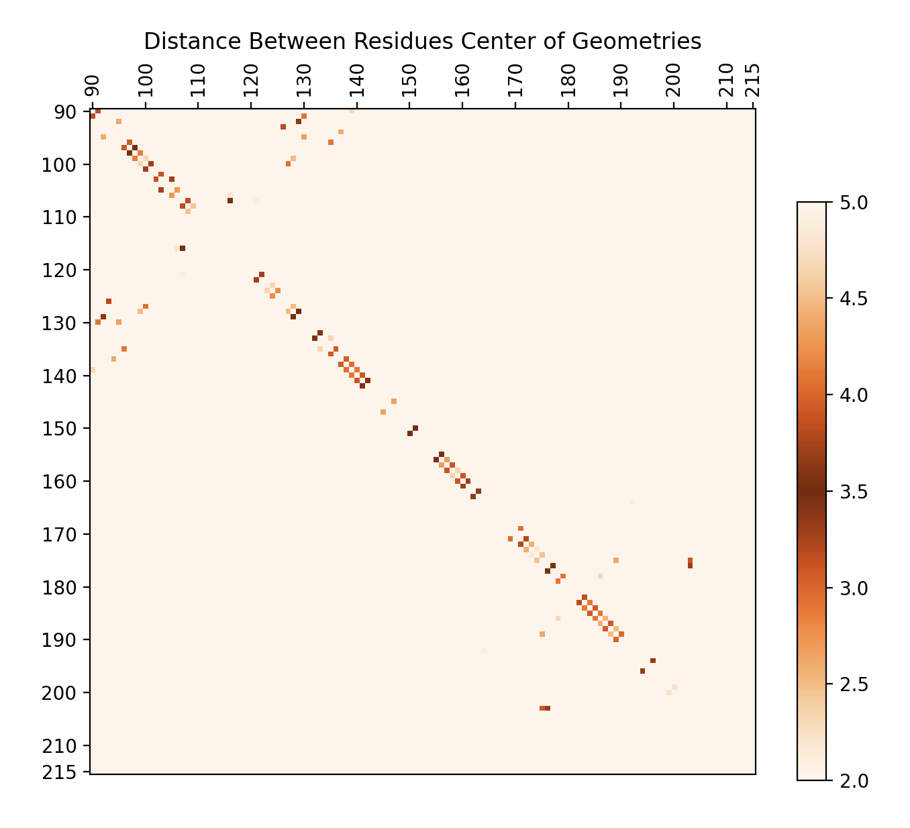

# Molecular Dynamics Background

Contains background on Molecular Dynamics (MD) simulations and pi-stacking interactions between residues.

## Molecular Dynamics (MD)
- To reference later: [Weir Lab Wiki on MD](http://weirlab.wescreates.wesleyan.edu./index.php?n=Site.MDTheory)
- For now: Method of viewing molecules by applying physics (atomic mass, electrostatics, intermolecular interactions) to a 3D molecule structure and observing it's behavior over a set time interval.
- Split into frames, with a set number of frames/ns of simulation.

## Pi-Stacking
- To reference later: [Taylor Paper](https://doi.org/10.1007/s00214-020-02668-y)
- For now: a type of attractive interaction between two ring molecules within a structure.
- Simplified discussion of electron clouds on aromatic rings
- Orbital hybridization and the pi/pi* interactions that lead to pi-stacking

