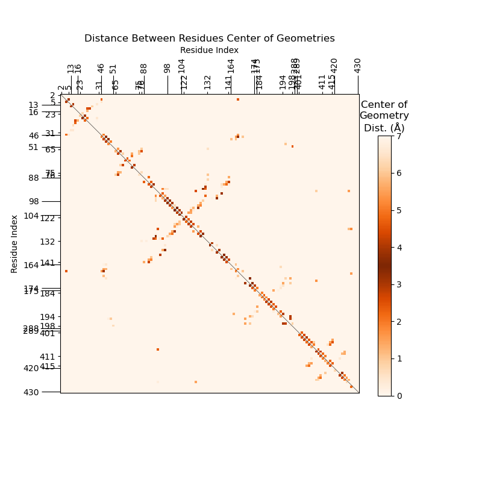
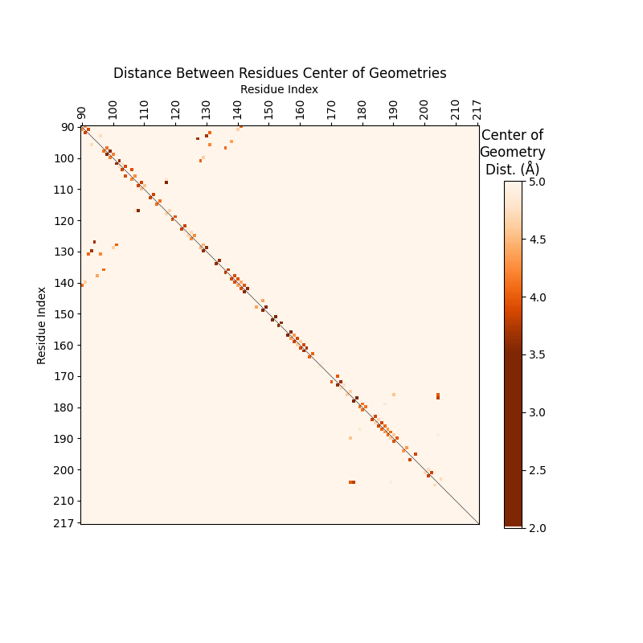

.. _command_line_options:

***********************
Command Line Options
***********************

After installing StACKER, the command ``stacker`` is added
to terminal. Different routines can be run in the command Line
using ``stacker -s ROUTINE``. Running ``stacker --help`` 
will give the subroutine options::

    [user]$ stacker --help
    usage: stacker -s ROUTINE [-h]

    Wrapper to run stacker subroutines using the -s flag.
    More info on each routine given by `stacker -s ROUTINE -h`

    options:
    -s, --script ROUTINE  Name of command to use. Options for ROUTINE:
                            
                            filter_traj:
                                    filters trajectory and topology files to desired residue numbers and atom names
                            bottaro OR pairwise OR psf:
                                    Create Polar Stacking Fingerprint like those in Figure 1 of Bottaro et. al (https://doi.org/10.1093/nar/gku972)
                            res_distance:
                                    Get the distance between two residues in a given frame
                            system OR ssf:
                                    Create a System Stacking Fingerprint of distances by residue
                            stack_events:
                                    Get list of residues with most stacking events (distance closest to 3.5Å)
                            compare:
                                    Get the most changed stacking events between two fingerprints using the outputs of stacker -s stack_events
    -h, --help            show this help message and exit

Filtering Trajectory
--------------------
Running ``stacker -s filter_traj`` will filter a trajectory by
residue/atom indices and output the trajectory to a ``.pdb``.
Running ``stacker -s filter_traj --help`` will give more flag options::

    [user]$ stacker -s filter_traj --help
    usage: stacker -s ROUTINE -trj TRAJECTORY_FILENAME -top TOPOLOGY_FILENAME -o OUTPUT_FILE [-r RESIDUES] [-a ATOM_NAMES] [-h]

    Filters trajectory and topology files to desired residue numbers and atom names and outputs to a PDB

    Examples:
    [user]$ stacker -s filter_traj -trj testing/first10_5JUP_N2_tUAG_aCUA_+1GCU_nowat.mdcrd -top testing/5JUP_N2_tUAG_aCUA_+1GCU_nowat.prmtop -o testing/command_line_tests/filter/5JUP_N2_tUAG_aCUA_+1GCU_nowat_mdcrd.pdb -r 426,427 -a C2,C4,C6

    options:
    -s, --script ROUTINE  Name of command to use. Options for ROUTINE:
                            
                            filter_traj:
                                    filters trajectory and topology files to desired residue numbers and atom names
                            bottaro OR pairwise OR psf:
                                    Create Polar Stacking Fingerprint like those in Figure 1 of Bottaro et. al (https://doi.org/10.1093/nar/gku972)
                            res_distance:
                                    Get the distance between two residues in a given frame
                            system OR ssf:
                                    Create a System Stacking Fingerprint of distances by residue
                            stack_events:
                                    Get list of residues with most stacking events (distance closest to 3.5Å)
                            compare:
                                    Get the most changed stacking events between two fingerprints using the outputs of stacker -s stack_events
    -r, --residues RESIDUES
                            Smart-indexed list of 1-indexed residues, also accepts dash (-) list creation (eg. 1-5,10 = 1,2,3,4,5,10)
    -a, --atom_names ATOM_NAMES
                            Comma-separated list of atom names to filter
    -h, --help            show this help message and exit

    Required Arguments:
    -trj, --trajectory TRAJECTORY_FILENAME
                            Filepath to trajectory file for the MD simulation
    -top, --topology TOPOLOGY_FILENAME
                            Filepath to Topology file for the MD simulation
    -o, --output OUTPUT_FILE
                            Filepath of PDB to output to

.. currentmodule:: stacker.file_manipulation

This is the command line equivalent of :func:`filter_traj_to_pdb`. So, the following are equivalent::
        
        >>> import stacker as st
        >>> st.filter_traj_to_pdb(
        ...     trj_file = "first10_5JUP_N2_tUAG_aCUA_+1GCU_nowat.mdcrd",
        ...     top_file = "5JUP_N2_tUAG_aCUA_+1GCU_nowat.prmtop",
        ...     pdb = "5JUP_N2_tUAG_aCUA_+1GCU_nowat_mdcrd.pdb",
        ...     residues = "426,427",
        ...     atoms = {"C2","C4","C6"}
        ... )

::

        [user] $ stacker -s filter_traj \
                        -trj first10_5JUP_N2_tUAG_aCUA_+1GCU_nowat.mdcrd \
                        -top 5JUP_N2_tUAG_aCUA_+1GCU_nowat.prmtop \
                        -o 5JUP_N2_tUAG_aCUA_+1GCU_nowat_mdcrd.pdb \
                        -r 426,427 \
                        -a C2,C4,C6

Get Distance Between Residues
-----------------------------
Running ``stacker -s res_distance`` will give the distance in Angstroms
between the center of geometry of two residues for a given frame.
Running ``stacker -s res_distance --help`` will give more flag options::

    [user]$ stacker -s res_distance --help
    usage: stacker -s ROUTINE -trj TRAJECTORY_FILENAME -top TOPOLOGY_FILENAME [-f FRAME_NUM] -r RESIDUES [-b N_FRAMES] [-a ATOM_NAMES] [-h]

    Get the distance between two residues in a given frame

    Examples:
    [user]$ stacker -s res_distance -trj testing/first10_5JUP_N2_tUAG_aCUA_+1GCU_nowat.mdcrd -top testing/5JUP_N2_tUAG_aCUA_+1GCU_nowat.prmtop -f 2 --residues 426,427 --atom_names C2,C4,C6

    options:
    -s, --script ROUTINE  Name of command to use. Options for ROUTINE:
                            
                            filter_traj:
                                    filters trajectory and topology files to desired residue numbers and atom names
                            bottaro OR pairwise OR psf:
                                    Create Polar Stacking Fingerprint like those in Figure 1 of Bottaro et. al (https://doi.org/10.1093/nar/gku972)
                            res_distance:
                                    Get the distance between two residues in a given frame
                            system OR ssf:
                                    Create a System Stacking Fingerprint of distances by residue
                            stack_events:
                                    Get list of residues with most stacking events (distance closest to 3.5Å)
                            compare:
                                    Get the most changed stacking events between two fingerprints using the outputs of stacker -s stack_events
    -f, --frame FRAME_NUM
                            1-indexed Frame Number within trajectory to analyze
    -b, --bootstrap N_FRAMES
                            Run bootstrap analysis on this residue pairing, sampling N_FRAMES with replacement
    -a, --atom_names ATOM_NAMES
                            Comma-separated list of atom names. Three required to get center of geometry for a residue. default = C2,C4,C6
    -h, --help            show this help message and exit

    Required Arguments:
    -trj, --trajectory TRAJECTORY_FILENAME
                            Filepath to trajectory file for the MD simulation
    -top, --topology TOPOLOGY_FILENAME
                            Filepath to Topology file for the MD simulation
    -r, --residues RESIDUES
                            Smart-indexed list of 1-indexed residues, must provide only 2 residues, accepts dash (-) list creation (eg. 1-5,10 = 1,2,3,4,5,10)

.. currentmodule:: stacker.pairwise_distance

This is the command line equivalent of :func:`get_residue_distance_for_frame`. 
So, the following are equivalent::

        >>> import stacker as st
        >>> filtered_traj = st.filter_traj('first10_5JUP_N2_tUAG_aCUA_+1GCU_nowat.mdcrd', 
        ...                              '5JUP_N2_tUAG_aCUA_+1GCU_nowat.prmtop', 
        ...                              residues = {426,427}, 
        ...                              atoms = {'C2','C4','C6'})
        >>> st.get_residue_distance_for_frame(
        ...     trj = filtered_traj,
        ...     frame = 3, 
        ...     res1_atoms = ("C2", "C4", "C6"),
        ...     res2_atoms = ("C2", "C4", "C6"),
        ...     write_output = True
        ...)

::

        [user] $ stacker -s res_distance \
                        -trj first10_5JUP_N2_tUAG_aCUA_+1GCU_nowat.mdcrd \
                        -top 5JUP_N2_tUAG_aCUA_+1GCU_nowat.prmtop \
                        -r 426,427 \
                        -f 3 \
                        -a C2,C4,C6

Create System Stacking Fingerprints (SSFs)
------------------------------------------

Running ``stacker -s ssf`` will create a System Stacking
Fingerprint (SSF) for the trajectory, with many options to customize
the plot outputs. Running ``stacker -s ssf --help`` will give 
more flag options::

        [user]$ stacker -s ssf --help
        usage: stacker -s ROUTINE -trj TRAJECTORY_FILENAME -top TOPOLOGY_FILENAME [-r RESIDUES] [-i INPUT_FILE] [-f FRAME_NUM | -fl FRAME_LIST] [-o OUTPUT_FILE]
                [-g N_EVENTS] [-d OUTPUT_FILE] [-B INPUT_FILE] [-l LIMITS] [-y SCALE_STYLE] [-t N_THREADS] [-h]

        Creates a System Stacking Fingerprint of the average structure across the chosen frames of a trajectory.

        Examples:

        [user]$ stacker -s system -trj testing/first10_5JUP_N2_tUAG_aCUA_+1GCU_nowat.mdcrd -top testing/5JUP_N2_tUAG_aCUA_+1GCU_nowat.prmtop -r 90-215 -fl 1-2

        [user]$ stacker -s ssf -trj testing/first10_5JUP_N2_tUAG_aCUA_+1GCU_nowat.mdcrd -top testing/5JUP_N2_tUAG_aCUA_+1GCU_nowat.prmtop -r 90-215 -fl 1-2 -g 10 -o testing/command_line_tests/pairwise/5JUP_N2_tUAG_aCUA_+1GCU_nowat_pairwise_avg_1to2.png -d testing/command_line_tests/pairwise/5JUP_N2_tUAG_aCUA_+1GCU_data_1to2.txt

        options:
        -s, --script ROUTINE  Name of command to use. Options for ROUTINE:
                        
                                filter_traj:
                                filters trajectory and topology files to desired residue numbers and atom names
                                bottaro OR pairwise OR psf:
                                Create Polar Stacking Fingerprint like those in Figure 1 of Bottaro et. al (https://doi.org/10.1093/nar/gku972)
                                res_distance:
                                Get the distance between two residues in a given frame
                                system OR ssf:
                                Create a System Stacking Fingerprint of distances by residue
                                stack_events:
                                Get list of residues with most stacking events (distance closest to 3.5Å)
                                compare:
                                Get the most changed stacking events between two fingerprints using the outputs of stacker -s stack_events
        -r, --residues RESIDUES
                        Smart-indexed list of 1-indexed residues, also accepts dash (-) list creation (eg. 1-5,10 = 1,2,3,4,5,10)
        -i, --input INPUT_FILE
                        Input .txt file containing per-frame stacking information, in lieu of running stacking fingerprint analysis again.
                        TXT file can be created by running `stacker -s system -d OUTPUT_FILE`
                        -r flag must match the residues used to create the TXT file
        -f, --frame FRAME_NUM
                        1-indexed Frame Number within trajectory to analyze, cannot be used with -fl
        -fl, --frame_list FRAME_LIST
                        Smart-indexed list of 1-indexed Frame Numbers within trajectory to analyze,
                        gets average distance between residues across these frames
                        if empty all frames are used, cannot be used with -f
        -o, --output OUTPUT_FILE
                        Filename of output PNG to write plot to. If empty, will output displays to Python visual
        -g, --get_stacking N_EVENTS
                        Get list of N_EVENTS residues with most stacking events (distance closest to 3.5Å) in the average structure across all frames.
                        Print to standard output. Equivalent to -s stack_events -n N_EVENTS
        -d, --data_output OUTPUT_FILE
                        Output the calculated per-frame numpy arrays that create the stacking fingerprint matrix to a file
        -B, --input_B INPUT_FILE
                        Input .txt file containing per-frame stacking information for a second fingerprint, creates fingerprint where top left is initial input, bottom right is second fingerprint.
                                Used in lieu of running stacking fingerprint analysis again.
                        TXT file can be created by running `stacker -s system -d OUTPUT_FILE`
                        -r flag must match the residues used to create the TXT file
        -l, --limits LIMITS   limits of the color scale, default = (0,7)
        -y, --scale_style SCALE_STYLE
                                style of color scale. {bellcurve, gradient}
        -t, --threads N_THREADS
                        Use multithreading with INT worker threads
        -h, --help            show this help message and exit

        Required Arguments:
        -trj, --trajectory TRAJECTORY_FILENAME
                        Filepath to trajectory file for the MD simulation
        -top, --topology TOPOLOGY_FILENAME
                        Filepath to Topology file for the MD simulation

Get Average SSF
===============

The basic SSF Command Line function runs :func:`get_frame_average` and
:func:`system_stacking_fingerprints`, creating an SSF for the 
trajectory averaged across all frames::

        >>> import stacker as st
        >>> filtered_traj = st.filter_traj('first10_5JUP_N2_tUAG_aCUA_+1GCU_nowat.mdcrd', 
                            '5JUP_N2_tUAG_aCUA_+1GCU_nowat.prmtop', 
                            residues = '90-215', 
                            atoms = {'C2','C4','C6'})
        >>> ssfs = st.system_stacking_fingerprints(filtered_traj, frames = '1-2', write_output = False)
        >>> avg_ssf = st.get_frame_average(ssfs)
        >>> resSeqs = [res.resSeq for res in filtered_traj.topology.residues]
        >>> st.display_ssfs(avg_ssf, resSeqs)

::

        [user]$ stacker -s ssf \  
                        -trj first10_5JUP_N2_tUAG_aCUA_+1GCU_nowat.mdcrd \
                        -top 5JUP_N2_tUAG_aCUA_+1GCU_nowat.prmtop \
                        -r 90-215 \
                        -fl 1-2

Data Output
===========

There are three important flags to output the SSF data:

- ``-o, --output OUTPUT_FILE`` : Save SSF to an output PNG ``OUTPUT_FILE``.
- ``-g, --get_stacking N_EVENTS`` : Prints top stacking pairs to standard output.
Equivalent to :func:`get_top_stacking`, where ``N_EVENTS`` is the ``n_events`` parameter. 
- ``-d, --data_output OUTPUT_FILE`` : Output the list of SSFs to ``.txt.gz``. You can input 
this SSF data rather than recalculate each time.

Expanding on the command above, we create SSFs for frames 1-10 and use
``-t 10`` to calculate them in parallel::

        [user]$ stacker -s ssf \
                -trj first10_5JUP_N2_tUAG_aCUA_+1GCU_nowat.mdcrd \
                -top 5JUP_N2_tUAG_aCUA_+1GCU_nowat.prmtop \
                -r 90-215 \
                -fl 1-10 \
                -o 5JUP_N2_tUAG_aCUA_+1GCU_nowat.SSF.png \
                -d 5JUP_N2_tUAG_aCUA_+1GCU_nowat.data.txt.gz \
                -g 5 \
                -t 10 
        Res1    Res2    Avg_Dist
        117     108     3.43
        127     94      3.67
        93      130     3.68
        177     204     3.80
        197     195     3.85

This outputs the average SSF for frames 1-10 to ``5JUP_N2_tUAG_aCUA_+1GCU_nowat.SSF.png``:

.. image images/5JUP_N2_tUAG_aCUA_+1GCU_nowat.SSF.png

The list of top stacking events can be customized much further via the 
``stacker -s stack_events`` command. See "Get Top Stacking Events" below.

The ``-d`` flag above outputs the SSF data for each frame to 
``5JUP_N2_tUAG_aCUA_+1GCU_nowat.data.txt.gz``. We can read this into a
Python object representing the 10 frames of 126x126 residue SSFs 
with :func:`load_ssfs`::

        >>> import stacker as st
        >>> ssfs = st.load_ssfs("5JUP_N2_tUAG_aCUA_+1GCU_nowat.data.txt.gz")
        >>> ssfs.shape
        (10, 126, 126)

Inputting SSF Data
==================

In lieu of recalculating SSF data for a trajectory, the ``.txt.gz`` file
outputted by ``stacker -s ssf -d OUTFILE`` can be loaded in using:

- ``-i, --input INPUT_FILE`` : A ``.txt`` or ``.txt.gz`` containing per-frame SSF
data created by ``stacker -s ssf -d OUTFILE``.
- ``-B, --input_B INPUT_FILE`` : A second ``.txt`` or ``.txt.gz`` file that will be displayed
on the bottom left of the output SSF, allowing comparison between two SSFs. Must be the same 
shape as the data inputted by the ``-i`` flag.

When using these, the ``-trj``, ``-top``, and ``-r`` flags should be the same as those used
to create either input. In the code below, we input two ``.txt.gz`` files representing SSF 
data from the same structure with two different mRNA codons::
        
        [user]$ stacker -s ssf \
                -trj 5JUP_N2_tGGG_aCCU_+1GCU_nowat_2fpns.mdcrd \
                -top 5JUP_N2_tGGG_aCCU_+1GCU_nowat.prmtop \
                -r 2-5,13-16,23-31,46-51,65-76,88-104,122-141,164-175,184-198,288-289,401-415,420-430 \
                -i 5JUP_N2_tGGG_aCCU_+1GCU_data.txt.gz 

This will output the average SSF in minutes, as opposed to the hours it took to calculate 
the ``-i 5JUP_N2_tGGG_aCCU_+1GCU_data.txt.gz`` input data. 

Combined SSFs
--------------
The line over ``x=y`` indicates that the SSF is symmetrical. This makes sense,
as the distance from residue ``i`` to ``j`` is the same as from ``j`` to ``i``.
We can remove this redundancy by adding another trajectory's SSF in the bottom left 
half, for ease of comparison::

        [user]$ stacker -s ssf \
                -trj 5JUP_N2_tGGG_aCCU_+1GCU_nowat_2fpns.mdcrd \
                -top 5JUP_N2_tGGG_aCCU_+1GCU_nowat.prmtop \
                -r 2-5,13-16,23-31,46-51,65-76,88-104,122-141,164-175,184-198,288-289,401-415,420-430 \
                -i 5JUP_N2_tGGG_aCCU_+1GCU_data.txt.gz \
                -B 5JUP_N2_tGGG_aCCU_+1CGU_data.txt.gz 

To get the residue pairs whose stacking changed the most between the two SSFs,
see "Get Stacking Changes".

Customizing SSFs
================
We can customize SSFs to color stacking events more stringently:

- ``-l, --limits LIMITS`` : limits of the color scale, default = (0,7). Helps limit the pairings
visualized as pi-stacking.
- ``-y, --scale_style SCALE_STYLE`` : style of color scale. {bellcurve, gradient}

The SSFs we've displayed so far used the default ``limits = (0,7)`` and ``scale_style = bellcurve``.
The ``scale_style`` parameter can help label rare <3.5Å stacking events as stacking rather than
the lighter color caused by ``bellcurve``. Sterics generally prevent nucleotides from anything <3.4Å,
so this scale generally changes nothing and is a matter of personal preference.

::
        
        [user]$ stacker -s ssf \
                -trj first10_5JUP_N2_tUAG_aCUA_+1GCU_nowat.mdcrd \
                -top 5JUP_N2_tUAG_aCUA_+1GCU_nowat.prmtop \
                -r 90-215 \
                -fl 1-10 \
                -t 10 \
                -l 2,5 \
                -y gradient

Get Top Stacking Events
-----------------------
``stacker -s stack_events`` gives the top pi-stacking events (ie. the residue
pairs with COG distance closest to 3.5Å) for a given trajectory. A few important
flags:
- ``-i, --input INPUT_FILE`` : A ``.txt`` or ``.txt.gz`` containing per-frame SSF
data created by ``stacker -s ssf -d OUTFILE``.
- ``-o, --output OUTPUT_FILE`` : spreadsheet output goes to a ``.txt`` file. Used for future analysis.
- ``-n, --n_events N_EVENTS`` : show top ``N_EVENTS`` stacking events. We use ``-n -1``, which
outputs all residue pairs and their COG distance.
- ``-j, --include_adjacent`` : Include adjacent residues in the printed output. These
are much more likely to be stacking, you may be interested in only non-consecutive stacking residues.

::

        [user]$ stacker -s stack_events \
                -trj 5JUP_N2_tGGG_aCCU_+1GCU_nowat_2fpns.mdcrd \
                -top TOPOLOGIES/5JUP_N2_tGGG_aCCU_+1GCU_nowat.prmtop \
                -r 2-5,13-16,23-31,46-51,65-76,88-104,122-141,164-175,184-198,288-289,401-415,420-430 \
                -i 5JUP_N2_tGGG_aCCU_+1GCU_data.txt.gz \
                -o stack_events.GCU.txt  \
                -n -1 \
                -j
        WARNING: Residue Indices are expected to be 1-indexed
        Reading trajectory...
        Reading topology...
        Filtering trajectory...
        WARNING: Output filtered traj atom, residue, and chain indices are zero-indexed

The stacking events are outputted to ``stack_events.GCU.txt``. We can look at this file
to find the residue pairs closest to 3.5Å apart—those that are pi-stacking.

::

        [user]$ head stack_events.GCU.txt 
        Res1    Res2    Avg_Dist
        101     102     3.55
        139     138     3.61
        130     93      3.63
        172     170     3.68
        172     173     3.70
        48      49      3.71
        47      48      3.72
        129     130     3.76
        136     97      3.78

Get Stacking Changes
--------------------

Once we have used ``stacker -s stack_events`` to get the top stacking events
for a single trajectory, we can run ``stacker -s compare`` to get the residue
pairs that changed the most between two different trajectories. These trajectories
must be comparable (ie. have the same number of residues). Generally, they should
be the same structure with very minor tweaks. The two trajectories used below are
the same ribosome PDB with one codon of the mRNA changed::

        [user]$ stacker -s compare \
                -A stack_events.GCU.txt \
                -B stack_events.CGU.txt \
                -SA _tGGG_aCCU_+1GCU \
                -SB _tGGG_aCCU_+1CGU

        Res1  Res2  Avg_Dist_tGGG_aCCU_+1GCU  Avg_Dist_tGGG_aCCU_+1CGU  Discrepancy
        47    48                      3.72                      4.30         0.58
        48    49                      3.71                      4.20         0.49
        122   123                      4.23                      3.75         0.48
        66    67                      3.98                      4.31         0.33
        133   134                      4.07                      3.75         0.32
        91    92                      3.91                      4.19         0.28
        95   138                      3.84                      4.11         0.27
        170   172                      3.68                      3.95         0.27
        422   423                      3.87                      4.11         0.24
        138   139                      3.61                      3.82         0.21

The output shows the average stacking distance between the residues in one trajectory
compared to the other, and lists them by the residue pairs whose stacking distance changed
the most.

