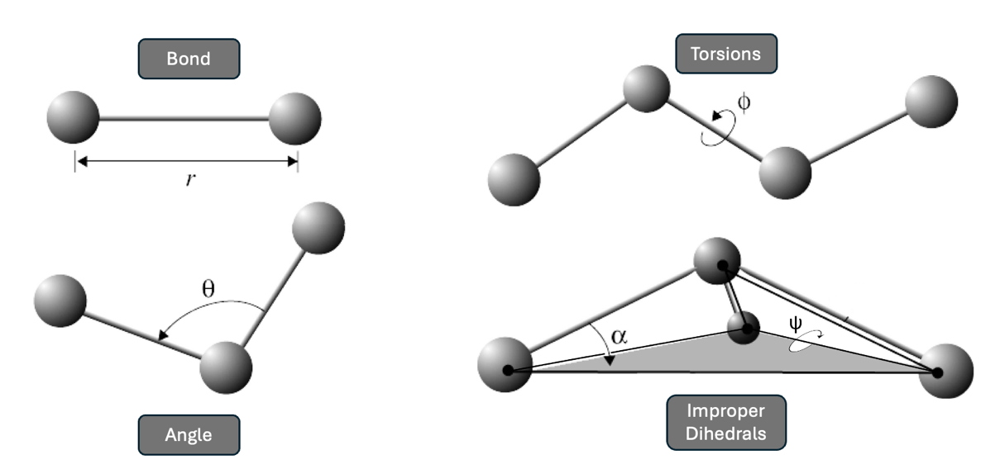

.. _molecular_dynamics:

   | **1.2** **Molecular Dynamics Theory**
   | Molecular Dynamics (MD) simulations are computer simulations of a
     molecular structure over a short period of time; used to illuminate
     biological behavior that is challenging or inaccessible by *in
     vivo* methods. Simulating a molecule is an incalculably complex
     task, oftentimes quite literally, as we will see in this section.
     Therefore, a number of techniques have been developed to ensure our
     computational models are physically accurate.

   In mathematics and computer science, it is customary to approach
   writing as inviting readers through the reasoning process (Su, 2015).
   I myself learned much of molecular dynamics theory in the preparation
   of this thesis, and I found it to be as informative as it was
   technical. Therefore, we will traverse this section as a series of
   problems and solutions to elucidate how the methods of this thesis
   developed.

   | *1.2.1Force Fields Predict Potential Energy Surfaces*
   | The molecular structures of the ribosome used throughout this
     thesis were developed using cryo-EM (Abeyrathne et al., 2016). When
     we are given this structure, the atoms are resolved to 3.5
     angstroms (Å), while a carbon-carbon single bond is 1.5 Å.
     Therefore, a number of atoms may not be in their true position, but
     rather in a position with significant energetic strain, which we
     measure as the total potential energy of the system. This presents
     us with our first problem: we must move the molecule into its true
     conformation, the most energetically favorable.

26

   | Doing so requires us to write a potential energy function, which
     will give us the energy of the system as a function of all the atom
     coordinates. Finding the most energetically favorable structure
     means finding the minimum of this
   | function. This is often presented as a Potential Energy Surface
     (PES). Figure 1.2.1 shows the PES for water, where the potential
     energy function takes in two values, H-O-H bond angle and bond
     length, then returns the potential energy. By
   | inputting two numbers and outputting one, we say our potential
     energy function *U* is a mapping #: ℝ!→ℝ. A stable structure would
     be found at an energy
   | minimum, the lowest point on the surface.

   .. image:: md_images/media/image1.png
      :width: 5.65972in
      :height: 3.60417in

   *Figure 1.2.1:* **Potential Energy Surface for Water**\ *. The z-axis
   shows potential energy as two qualities of the water molecule are
   varied along the x- and y-axis. The energy minimum is found at an
   H-O-H angle of 104.5° and a bond length of 0.0958 nm (Scopino,
   2020).*

27

   For our ribosome system, that has thousands of atoms, our potential
   energy function *U* takes the x-, y-, z-coordinates of all of the
   atoms as input. With *N* atoms, this makes *U* a mapping #: ℝ"#→ℝ,
   meaning we need *3N+1* axes to visualize the surface, which is
   impossible supposing a three-dimensional thesis reader. The lack of
   visualization does not, however, presuppose the lack of a minimum. A
   popular example is the function ': ℝ"→ℝ, where '(), +, ,) is the
   temperature of a room at position (x, y, z) in 3D coordinates. We
   cannot visualize this function, as we would need all three dimensions
   for our x-, y-, z-positions and would have none left over for the
   temperature variable. Yet, this room certainly has an (x, y, z)
   position with the minimum temperature. Our ribosome PES is much the
   same; we may not be able to visualize it, but there is a
   configuration of atoms that begets the lowest potential energy.

   We now arrive at the problem of designing our potential energy
   function.

   | Ideally, our function would utilize quantum mechanics to calculate
     probabilistic electron densities and the interaction of each atom
     with all other atoms in the system. However, doing so for more than
     a handful of atoms becomes
   | computationally infeasible. The solution: force fields.

   | Force fields utilize experimental data and some quantum mechanics
     to calculate a highly accurate estimate of the result of the purely
     quantum
   | mechanical approach. By incorporating as many atomic interactions
     as possible, and making clever approximations, we can balance
     accuracy with computational efficiency to arrive at a sufficient
     heuristic. A number of factors are considered in our simulation’s
     force field calculations.

28

   In lieu of electron cloud overlap and solving of the complex
   Schrodinger wave equation, we can treat all bonds as two masses
   connected by a spring. Then, we can simply use Hooke’s law of spring
   potential energy to calculate the potential energy induced by the
   stretching and compressing of all bonds in the structure.

+-----------------------------------+-----------------------------------+
|    | # = 0 1                      |    3$(4 −4 ))!                    |
|    | 2                            |                                   |
|                                   |                                   |
| $%&'(                             |                                   |
+===================================+===================================+
+-----------------------------------+-----------------------------------+

..

   This is a strong start, but we can include a number of other factors.
   The oscillation of bond angles 6, for instance, can also be modeled
   using Hooke’s law.

   We then consider torsional potential induced by the bond rotation 7.
   Adding these to our equation gives us:

+-------------+-------------+-------------+-------------+-------------+
|    # = 0 1  | 3$(4 −4 ))! | 3.(6 −6))!+ | 0           |    [1 + cos |
|    2        | + 0 1 2     |             |             |    (=7 +    |
|             |             |             |             |    >)]      |
| $%&'(       | \*&+,-(     |             |             |             |
+=============+=============+=============+=============+=============+
|             |             |             | /%0(1%&(    |             |
+-------------+-------------+-------------+-------------+-------------+

..

   Finally, we include strain due to improper dihedrals, the force that
   keeps some atoms in a plane to prevent chiral flips. To account for
   non-bonding interactions, we calculate van der Waals interactions
   using the Lennard-Jones potential, and electric potential energy
   between charged groups using Coulomb’s law. These equations come
   together to form a complete force field equation to estimate the
   system’s potential energy (Cowan, 2022).

+------+------+------+------+------+------+------+------+------+------+
|    # | 3$(4 |      |      |      | 3.(6 |      | 0    |      |      |
|    = | −4   |      |      |      | −6   |      |      |      |   [1 |
|    0 | ))!  |      |      |      | ))!+ |      |      |      |    + |
|    1 | + 0  |      |      |      |      |      |      |      |      |
|    2 | 1 2  |      |      |      |      |      |      |      |  cos |
|      |      |      |      |      |      |      |      |      |      |
| $    | \*&  |      |      |      |      |      |      |      |  (=7 |
| %&'( | +,-( |      |      |      |      |      |      |      |    + |
|      |      |      |      |      |      |      |      |      |      |
|      |      |      |      |      |      |      |      |      |  >)] |
+======+======+======+======+======+======+======+======+======+======+
|      |      |      |      |      |      |      | /%0( |      |      |
|      |      |      |      |      |      |      | 1%&( |      |      |
+------+------+------+------+------+------+------+------+------+------+
|      | +    | 0    | @    | D14  |      |      |      |      |      |
|      |      |      | 123  | 5!   |      |  D14 |      |  | + |      |
|      |      |      |      |      |      |    6 |      |      |      |
|      |      |      |      |    + |      |      |      |    0 |      |
|      |      |      |      |    0 |      | 4 14 |      |      |      |
|      |      |      |      |      |      | 6E   |      |      |      |
|      |      |      |      | 4B14 |      |      |      | F1F4 |      |
|      |      |      |      |    C |      |      |      |      |      |
|      |      |      |      |      |      |      |      |   |  |      |
|      |      |      |      |      |      |      |      | -,-9 |      |
|      |      |      |      |   78 |      |      |      |      |      |
|      |      |      |      |    4 |      |      |      |    4 |      |
|      |      |      |      |      |      |      |      |      |      |
|      |      |      |      |   14 |      |      |      |   14 |      |
|      |      |      |      |      |      |      |      |      |      |
|      |      |      |      |  5!− |      |      |      |      |      |
+------+------+------+------+------+------+------+------+------+------+
|      |      | 1230 |      |      |      |      |      |      |      |
|      |      | %3-0 |      |      |      |      |      |      |      |
+------+------+------+------+------+------+------+------+------+------+

29

   *Figure 1.2.2:* **Interactions considered in force fields.** *The
   force field equation considers bond length, bond angle, torsions
   (bond twist), and improper dihedrals.*

   | Once the potential energy is calculated, we can use a number of
   | techniques to move to a local energy minimum. We should note two
     assumptions that we have made before moving to MD simulations.
     First, we assume that the cryo-EM structure is similar to the
     native structure. Second, that the native structure lies at an
     energy minimum. That way, our starting structure already begins in
     a “well” of the PES, and we simply need to adjust to the minima.
     With our energy minimized structure in hand, we can move to
     molecular dynamics.

   | *1.2.2Computational Genetics*
   | To observe the ribosome/mRNA interactions, we utilize a subsystem
     of the ribosome containing the decoding center (Figure 1.1.4B). As
     will be explained further in the Methods section, the neighborhood
     is a 40 Å sphere centered at the C1054 of CAR, therefore containing
     the A-site codon and anticodon, CAR, the +1 codon, and a number of
     the surrounding residues.

30

   Our goal is to explore the allosteric effect of +1 codon identity on
   the ribosome. To do so, we need cryo-EM structures with various +1
   codons, ideally in the same stage of translocation. However, our
   structures only have a +1GCU.

   To account for this, we induce the change computationally and observe
   the conformational impact. For instance, to analyze a +1CGU
   structure, we must exchange the +1G1 and +1C2 for a +1C1 and +1G2. We
   delete much of the +1G1 and +1C2 nucleotide base from our cryo-EM
   +1GCU structure, keeping only the atoms that are in common with the
   +1C1 and +1G2 we are adding. Then, we use AMBER’s tLEaP to “grow in”
   the two new nucleotides: +1C1 and +1G2. We can then implement the
   energy minimization methods discussed in Section 1.2.1 to relax the
   steric tension of this addition and observe the structural changes.

   Recently, the Weir laboratory has found that +1 codon identity may,
   by itself, be too simplified a regulation model. In Sun *et al.,*
   wehypothesize that codon adjacency—a pair of codons in the A-site and
   +1 site—provides a more nuanced regulation story. We found that +1GCU
   codons following an NNU A-site codon had elevated ribosome densities
   (indicating slower translation), more H-bonds with CAR in MD, and
   were overrepresented in yeast reading frames when compared to +1GCU
   following NNC (Sun et al., 2024). Here, we expand this analysis to
   novel A-site codons and tRNA anticodons to investigate the impact of
   A-site identity on the overall subsystem conformation.

   These studies are given the name “computational genetics,” and it is
   an apt one. As with many genetics studies, we too are inducing a
   mutation and observing

31

   a phenotypic change. Our study is *in silico*, via a computational
   medium, rather than *in vivo.*

   | *1.2.3MD Unveils New Energy Minima*
   | Our desire to explore more complex structures brings new problems,
     though we can view these as opportunities for more clever
     solutions. Unlike the PES of water shown in Figure 1.2.1,
     structures as complex as our ribosome have a number of
     conformations that are energetically stable, therefore a number of
     minima on the potential energy surface (Figure 1.2.3). However, our
     energy minimum algorithm described in Section 1.2.1 moves directly
     “downhill” to the local minimum. Additionally, interconversion
     between these wells may require overcoming a transition state that
     is too unfavorable.

   | Molecular dynamics (MD) overcomes this by heating the system to a
     higher-energy state and running multiple replicates to sample as
     many
   | conformations as possible. Heating encompasses distributing initial
     velocities to all the atoms of the structure based on the
     Maxwell-Boltzmann law (Mozetič et al., 2019). With our heated
     structure now able to roam high-energy positions on the PES, we can
     apply molecular kinematics to quench the system into a new energy
     minimum. The kinematics are simply an expansion of the force field
     potential energy equation in Section 1.2.1, which we convert to
     atomic
   | movement. The negative derivative of our potential energy *U* gives
     the force *F* on an atom, which we input into Newton’s second law
     along with the atomic mass to calculate acceleration *a*:

+-----------------------------------------------------------------------+
| −G# [STRIKEOUT:GH]\ = I = JK ⇒K = I J                                 |
+=======================================================================+
+-----------------------------------------------------------------------+

32

   | We apply each atom’s acceleration to adjust the atomic velocities
     and, therefore, positions at discrete timesteps. The new atomic
     positions create a novel structural conformation, called a frame,
     with an updated potential energy *U* for each atom. This is the
     cycle of MD simulation: a structure—or “topology”—gives potential
     energy *U* for each atom\ *,* which informs atomic acceleration
     and,
   | therefore, atomic position in a new topology frame. We can stitch
     together a sequence of frames into a “trajectory,” much like the
     frames in a movie. The number of frames and therefore time length
     of each MD replicate is described further in Section 2.1.3.

\\

   .. image:: md_images/media/image3.png
      :width: 5.94583in
      :height: 3.14722in

   *Figure 1.2.3:* **Estimated potential energy surface for lysozyme
   folding. (A)** *The PES shows multiple wells (local energy minima)
   where the energy minimization may settle the structure. The arrows
   show multiple paths an MD trajectory may take to visit energetically
   favorable states (wells) and overcome transition states.* **(B)**
   *Top down view of the same surface, illuminating the energy minima
   (Dobson et al., 1998).*

33
