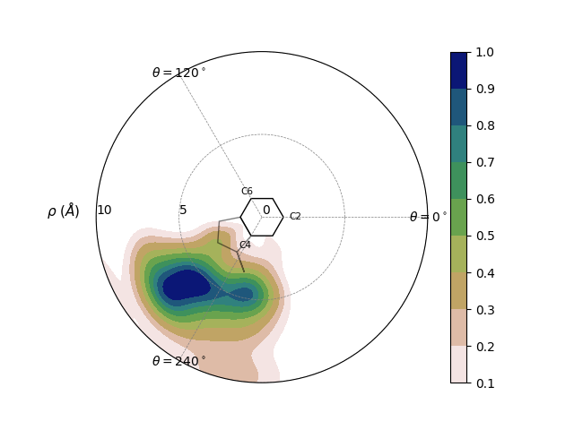
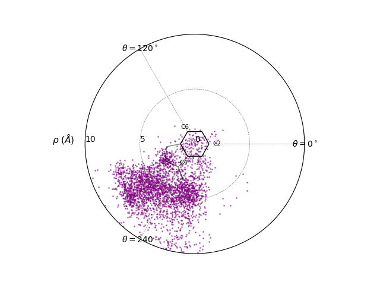
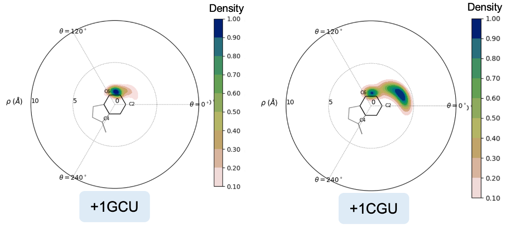
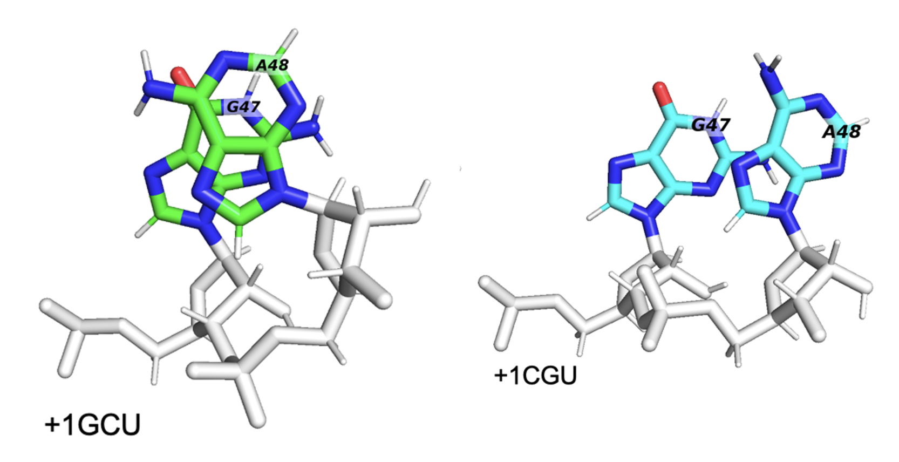

.. _pairwise_stacking:

********************************************
Making Pairwise Stacking Fingerprints (PSFs)
********************************************

Once you've identified a pi-stacking residue pair, you can use StACKER to 
characterize the type of stacking occuring using Pairwise Stacking Fingerprints (PSFs)
like the one below.

.. currentmodule:: stacker.pairwise_distance

Identify a Pi-Stacking Pair
------------------------------
Users can identify a residue pair engaging in pi-stacking
by using the :ref:`System Stacking Fingerprint Pipeline <system_stacking>`.

Filter Molecular Dynamics Trajectory
------------------------------------
In this example pipeline, we use a trajectory of the 
`Ribosome CAR-mRNA Interaction Surface <https://www.mdpi.com/1422-0067/23/3/1417>`_
found in the `StACKER GitHub Repository <https://github.com/esakkas24/stacker/tree/main/testing>`_.
We filter this trajectory to the pi-stacking residue pair.

MD Files are provided for testing convenience in the testing folder:

- ``first10_5JUP_N2_tUAG_aCUA_+1GCU_nowat.mdcrd``: A 10-frame trajectory file with all atoms/residues.
- ``5JUP_N2_tUAG_aCUA_+1GCU_nowat.prmtop``: The associated Topology File with the above trajectory.

.. currentmodule:: stacker.file_manipulation

Using the :ref:`System Stacking Fingerprint Pipeline <system_stacking>` we found that residues 426 and 427
are pi-stacking. We filter the data from all residues to 426 and 427 and output it to a trajectory ``.pdb`` file
using :func:`filter_traj_to_pdb`::

    >>> import stacker as st
    >>> st.filter_traj_to_pdb("first10_5JUP_N2_tUAG_aCUA_+1GCU_nowat.mdcrd", 
    ...                       topology_filename = "5JUP_N2_tUAG_aCUA_+1GCU_nowat.prmtop", 
    ...                       output_pdb_filename = "first10_5JUP_N2_tUAG_aCUA_+1GCU_nowat.pdb",
    ...                       residues_desired = {426, 427}, 
    ...                       atomnames_desired = {"C2", "C4", "C6"})
    WARNING: Residue Indices are expected to be 1-indexed
    Reading trajectory...
    Reading topology...
    Filtering trajectory...
    WARNING: Output filtered traj atom, residue, and chain indices are zero-indexed
    WARNING: Output file atom, residue, and chain indices are zero-indexed
    Filtered trajectory written to:  first10_5JUP_N2_tUAG_aCUA_+1GCU_nowat.pdb

So the file ``first10_5JUP_N2_tUAG_aCUA_+1GCU_nowat.pdb`` contains the trajectory information for only
residues 426 and 427 for the first 10 frames. 

Write PSF Data to CSV
---------------------

Instead of the 10-frame file we've provided above, that same 
`GitHub testing <https://github.com/esakkas24/stacker/tree/main/testing>`_
repository includes:

- ``5JUP_N2_tUAG_aCUA_+1GCU_nowat_mdcrd_3200frames.pdb`` : A trajectory PDB of residues 426+427 with 3200 frames.

We continue with this PDB to include more frames worth of data.

.. currentmodule:: stacker.residue_movement

The data for a Pairwise Stacking Fingerprint (PSF) is outlined in `Bottaro et al <https://doi.org/10.1093/nar/gku972>`_ 
and labelled in the image below. Briefly, we characterize the movement of one residue relative to another by
getting the per-frame rho and theta value, which projects the center of geometry (COG) of the "viewed residue" onto the 
plane of the "perspective residue."

.. image:: images/bottaro_values.png

We use :func:`write_psf_data` to extract this data from the PDB to a CSV::

    >>> import stacker as st
    >>> st.write_psf_data("5JUP_N2_tUAG_aCUA_+1GCU_nowat_mdcrd_3200frames.pdb",
    ...                         output_csv_name = "script_tests/residue_movement/tUAG_aCUA_+1GCU_GC_plot.csv",
    ...                         perspective_residue_num = 426,
    ...                         viewed_residue_num = 427)
    Output values written to script_tests/residue_movement/tUAG_aCUA_+1GCU_GC_plot.csv
    >>> print("".join(open("script_tests/residue_movement/tUAG_aCUA_+1GCU_GC_plot.csv").readlines()[:10]))
    frame,r_dist,rho_dist,theta
    0,7.5253415,6.5321836,204.02934901525177
    1,6.884639,6.0513134,199.40647902703924
    2,7.301847,6.151191,205.1906453260924
    3,6.5815425,5.461494,199.5421877249345
    4,7.0760417,5.3919506,204.0150121540755
    5,7.2589145,6.3483577,201.32674968542617
    6,7.4929285,6.414151,205.92967194025135
    7,7.1484976,6.035165,202.88441276229827
    8,7.344863,5.541237,217.30043061558888

The PSF values are written to ``script_tests/residue_movement/tUAG_aCUA_+1GCU_GC_plot.csv``

Visualize PSF Data
------------------

.. currentmodule:: stacker.visualization

The PSF data can be visualized as a scatterplot using :func:`display_psf_scatter`::

    >>> st.display_psf_scatter(
    ...     'script_tests/residue_movement/tUAG_aCUA_+1GCU_GC_plot.csv', 
    ...     plot_outfile='script_tests/visualization/tUAG_aCUA_+1GCU_GC_plot_scatter.png'
    ...     )

The scatterplot is outputted to ``script_tests/visualization/tUAG_aCUA_+1GCU_GC_plot_scatter.png``:

For multi-frame trajectories like this one, the point density can make it hard to interpret the data.
We can create heatmaps instead with :func:`display_psf_heatmap`::

    >>> st.display_psf_heatmap(
    ...     'script_tests/residue_movement/tUAG_aCUA_+1GCU_GC_plot.csv',
    ...     plot_outfile='script_tests/visualization/tUAG_aCUA_+1GCU_GC_plot_heat.png'
    ...     )

In this image, we see that COG of the viewed residue often moves away from the perspective residue,
the ring outlined on the plot itself. This indicates that they are frequently falling out of pi-stacking,
and this pairing is a weak pi-stacking pair.

Comparing PSFs
--------------

Below are two PSFs of the pi-stacking pair residues 47 and 48, coming from two different trajectories,
one with a GCU in the +1-mRNA-codon and another with a CGU in the +1-mRNA-codon. Observe how the +1GCU
trajectory has 47 and 48 overlapping more frequently, hence the higher density in the center of the PSF.

When we look at the residues in a trajectory visualizer like PyMOL, we see that the +1GCU case has
better pi-stacking of residues 47+48, as expected.

