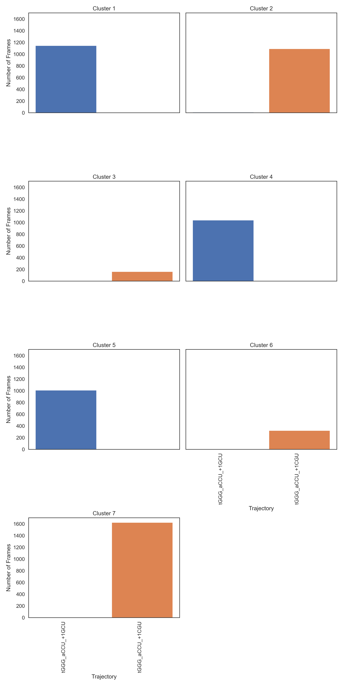
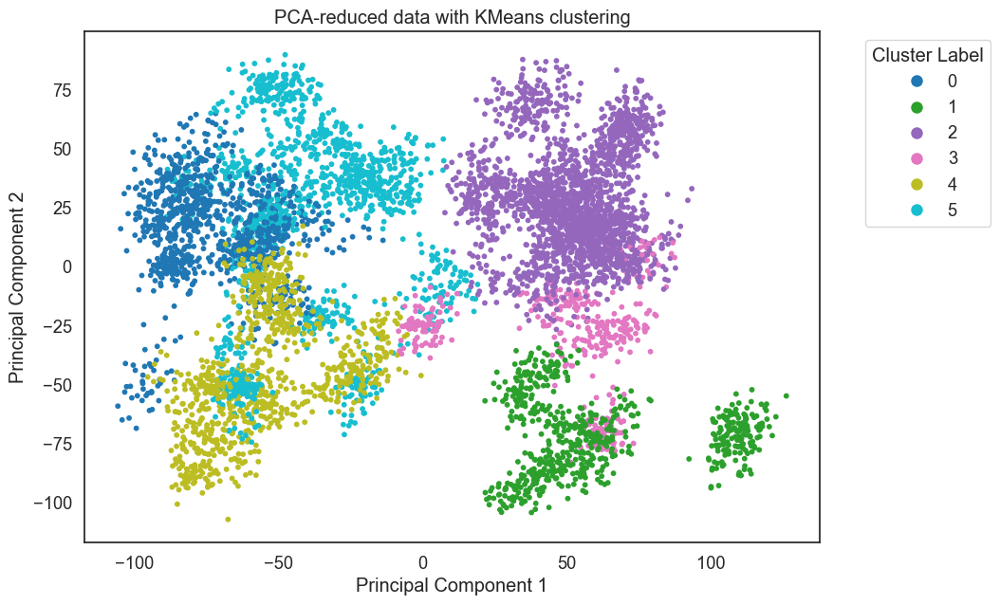

.. _system_stacking:

********************************************
Making System Stacking Fingerprints (SSFs)
********************************************

This pipeline creates System Stacking Fingerprints (SSFs) like the one below 
which can be used to analyze system-wide pi-stacking in a molecular dynamics trajectory.

Load Trajectory
---------------

To analyze pi-stacking between two nucleotides, we compare their center of
geometry (COG) distance, the distance between the centers of their 6-membered
(pyrimidine) rings (see ``r`` below). For this, the only atoms we need are C2, C4, and C6 to triangulate
the COG of each ring.

For reference, the Carbon Numbering of each nucleotide:

In this example pipeline, we use a trajectory of the 
`Ribosome CAR-mRNA Interaction Surface <https://www.mdpi.com/1422-0067/23/3/1417>`_
found in the `StACKER GitHub Repository <https://github.com/esakkas24/stacker/tree/main/testing>`_.
We filter this trajectory to the pi-stacking residue pair.

MD Files are provided for testing convenience in the testing folder:

- ``first10_5JUP_N2_tUAG_aCUA_+1GCU_nowat.mdcrd``: A 10-frame trajectory file with all atoms/residues.
- ``5JUP_N2_tUAG_aCUA_+1GCU_nowat.prmtop``: The associated Topology File with the above trajectory.

.. currentmodule:: stacker.file_manipulation

We filter to atoms C2, C4, and C6 using :func:`filter_traj`::

    >>> import stacker as st
    >>> filtered_traj = st.filter_traj("first10_5JUP_N2_tUAG_aCUA_+1GCU_nowat.mdcrd",
    ...                 top_file = "5JUP_N2_tUAG_aCUA_+1GCU_nowat.prmtop",
    ...                 atoms = {"C2", "C4", "C6"})
    WARNING: Residue Indices are expected to be 1-indexed
    Reading trajectory...
    Reading topology...
    Filtering trajectory...
    WARNING: Output filtered traj atom, residue, and chain indices are zero-indexed
    >>> filtered_traj
    <mdtraj.Trajectory with 10 frames, 756 atoms, 252 residues, without unitcells at 0x1164eab10>

Now the Python variable ``filtered_traj`` contains 10 frames of C2, C4, C6 information for all nucleotides.

Calculate Distance Between Residues
------------------------------------

.. currentmodule:: stacker.pairwise_distance

Immediately, we can check if a residue pair is pi-stacking in a given frame. We calculate 
the distance between the COG of two residues using :func:`calculate_residue_distance`.
COG distance close to 3.5 Å indicates pi-stacking. For instance, the A-site mRNA codons 
(residues 422, 423, and 424) are likely pi-stacking::

    >>> distance_vec = st.calculate_residue_distance(
    ...     filtered_traj,
    ...     res1_num = 422,
    ...     res2_num = 423,
    ...     frame = 3
    ... )
    >>> distance_vec.magnitude()
    3.509042

Create a System Stacking Fingerprint (SSF)
------------------------------------------

An SSF calculates the COG distance for all nucleotide pairs in a trajectory frame.
The result is a square matrix where position (i, j) represents the distance 
from residue i to residue j. This is done with :func:`get_residue_distance_for_frame`

The ``filtered_traj`` object has 252 residues, so we create a 252 x 252 SSF::

    >>> ssf = st.get_residue_distance_for_frame(filtered_traj, frame = 2, write_output = True)
    Loading: [####################################################################################################] Current Residue: 252/252 (100.0%)
    Frame 2 done.
    >>> ssf.shape
    (252, 252)

We can calculate the SSF for multiple frames of a trajectory using :func:`system_stacking_fingerprints`, which
accepts smart indexing of frames (eg. 1-3,15-17 = 1,2,3,15,16,17)::

    >>> ssfs = st.system_stacking_fingerprints(filtered_traj, frames = '1-3')
    >>> ssfs.shape
    (3, 252, 252)

``ssfs`` is now a list, where ``ssfs[i]`` is the SSF for frame ``i`` (0-indexed frame). If ``frames`` is empty,
the SSF will be calculated for all frames. For multi-frame
trajectories, it is recommended to use the ``threads`` option to parallelize, calculating the SSF for multiple
frames at once. When parralelizing, turn off standard output with ``write_output``::

    >>> ssfs = st.system_stacking_fingerprints(
    ...     filtered_traj,
    ...     frames = '1-10',
    ...     threads = 10,
    ...     write_output = False
    ... )
    >>> ssfs.shape
    (10, 252, 252)

Get the Average SSF for a Trajectory
------------------------------------------

Single-frame SSFs are rarely as illuminating as the average SSF for all frames
of a trajectory. Users can create this using :func:`get_frame_average`, using the 
output from :func:`system_stacking_fingerprints` in the step above::

    >>> ssfs = st.system_stacking_fingerprints(
    ...     filtered_traj,
    ...     frames = '1-10',
    ...     threads = 10,
    ...     write_output = False
    ... )
    >>> avg_ssf = st.get_frame_average(ssfs)
    >>> avg_ssf.shape
    (252, 252)

``avg_ssf`` contains averaged stacking information throughout the trajectory.
The next step shows how to analyze these results.

How to Visualize an SSF
-----------------------

.. currentmodule:: stacker.visualization

:func:`display_ssfs` will visualize SSFs in Python output, with each SSF frame
as a frame of the video::

    >>> import stacker as st
    >>> filtered_traj = st.filter_traj("first10_5JUP_N2_tUAG_aCUA_+1GCU_nowat.mdcrd",
    ...                 top_file = "5JUP_N2_tUAG_aCUA_+1GCU_nowat.prmtop",
    ...                 atoms = {"C2", "C4", "C6"})
    WARNING: Residue Indices are expected to be 1-indexed
    Reading trajectory...
    Reading topology...
    Filtering trajectory...
    WARNING: Output filtered traj atom, residue, and chain indices are zero-indexed
    >>> ssfs = st.system_stacking_fingerprints(
    ...     filtered_traj,
    ...     frames = '1-10',
    ...     threads = 10,
    ...     write_output = False
    ... )
    >>> resSeqs = [res.resSeq for res in filtered_traj.topology.residues]
    >>> st.display_ssfs(
    ...     ssfs,
    ...     res_indicies = resSeqs,
    ...     seconds_per_frame = 2
    ... )

.. currentmodule:: stacker.pairwise_distance

It is recommended to run :func:`get_frame_average` and then save the output
as a ``.png`` for comparison with other trajectories::

    >>> import stacker as st
    >>> filtered_traj = st.filter_traj("first10_5JUP_N2_tUAG_aCUA_+1GCU_nowat.mdcrd",
    ...                 top_file = "5JUP_N2_tUAG_aCUA_+1GCU_nowat.prmtop",
    ...                 atoms = {"C2", "C4", "C6"})
    WARNING: Residue Indices are expected to be 1-indexed
    Reading trajectory...
    Reading topology...
    Filtering trajectory...
    WARNING: Output filtered traj atom, residue, and chain indices are zero-indexed
    >>> ssfs = st.system_stacking_fingerprints(
    ...     filtered_traj,
    ...     frames = '1-10',
    ...     threads = 10,
    ...     write_output = False
    ... )
    >>> avg_ssf = st.get_frame_average(ssfs)
    >>> ssfs = [avg_ssf]
    >>> resSeqs = [res.resSeq for res in filtered_traj.topology.residues]
    >>> st.display_ssfs(
    ...     ssfs,
    ...     resSeqs,
    ...     tick_distance = 20,
    ...     outfile = "SSF_test.png",
    ...     scale_limits = (2,5),
    ...     xy_line = False
    ... )

:ref:`Command Line Options <command_line_options>` offers many future analyses,
including combining SSF images along the x=y line for visual comparison
with ``stacker -s ssf -B`` and ``stacker -s compare``.

How to Analyze an SSF
-----------------------

.. currentmodule:: stacker.pairwise_distance

:func:`get_top_stacking` will give the stacking pairs with the most
pi-stacking (ie. closest to 3.5Å)::
    
    >>> st.get_top_stacking(
    ...     filtered_traj,
    ...     avg_ssf
    ...     )
    Res1    Res2    Avg_Dist
    117     108     3.43
    153     54      3.35
    56      151     3.34
    94      127     3.67
    93      130     3.68

It is recommended to save the output to a ``.csv`` and use the other parameters
for :func:`get_top_stacking` to prepare for future analyses using the 
:ref:`Command Line Options <command_line_options>`::

    >>> st.get_top_stacking(
    ...     filtered_traj,
    ...     avg_ssf,
    ...     csv = 'top_stacking.csv',
    ...     n_events = -1,
    ...     include_adjacent = True
    ... )

In the command line, ``[user]$ stacker -s compare`` can give the residue
pairs that changed the most between trajectories, by inputting two ``csv``
outputs from :func:`get_top_stacking`. Use ``[user]$ stacker -s compare --help``
for more information.

Using K Means
-------------

You can compare multiple System Stacking Fingerprints via 
`K-Means <https://scikit-learn.org/1.5/modules/clustering.html#k-means>`_.
The algorithm takes multiple SSFs with no knowledge of their trajectory and
groups similar SSFs. Thus, the algorithm groups trajectories via similar 
system-wide stacking. 

**Note:** the SSFs must be comparable, meaning an equal amount of residues.

With StACKER's :ref:`Command Line Options <command_line_options>`, the ``.txt``
files below were created:

- ``testing/5JUP_N2_tGGG_aCCU_+1GCU_data.txt.gz`` : numpy array with 3200 SSFs 
- ``testing/5JUP_N2_tGGG_aCCU_+1GCU_data.txt.gz`` : numpy array with 3200 SSFs 

These files are too large to provide, but can be made with ``stacker -s ssf -d``.

.. currentmodule:: stacker.kmeans

They can be read as Python objects and reshaped::

    >>> import numpy as np
    >>> import math
    >>> GCU_3200_flattened_ssfs = np.loadtxt('../testing/5JUP_N2_tGGG_aCCU_+1GCU_data.txt.gz')
    >>> GCU_3200_flattened_ssfs.shape
    (3200, 16129)
    >>> GCU_3200_ssfs = GCU_3200_flattened_ssfs.reshape(GCU_3200_flattened_ssfs.shape[0], math.isqrt(GCU_3200_flattened_ssfs.shape[1]), math.isqrt(GCU_3200_flattened_ssfs.shape[1]))
    >>> GCU_3200_ssfs.shape
    (3200, 127, 127)

Or the files can be read and prepared for KMeans data
 with :func:`read_and_preprocess_data` and :func:`run_kmeans`::

    >>> import stacker as st
    >>> data_arrays  = st.read_and_preprocess_data(
    ...     ["testing/5JUP_N2_tGGG_aCCU_+1CGU_data.txt.gz",
    ...     "testing/5JUP_N2_tGGG_aCCU_+1GCU_data.txt.gz"]
    ... )
    >>> st.run_kmeans(data_arrays, N_CLUSTERS = 2)
    (6400, 16129)
    For n_clusters = 2 The average silhouette_score is : 0.10815289849518733
    Dataset: 5JUP_N2_tGGG_aCCU_+1CGU_data
            Cluster 1: 0 matrices
            Cluster 2: 3200 matrices
    Dataset: 5JUP_N2_tGGG_aCCU_+1GCU_data
            Cluster 1: 3120 matrices
            Cluster 2: 80 matrices

So the SSFs from the two datasets are distinct enough to separate into two clusters.
We can visualize this with :func:`plot_cluster_trj_data`::

    >>> import stacker as st
    >>> data_arrays  = st.read_and_preprocess_data(
    ...     ["testing/5JUP_N2_tGGG_aCCU_+1CGU_data.txt.gz",
    ...     "testing/5JUP_N2_tGGG_aCCU_+1GCU_data.txt.gz"]
    ... )
    >>> st.run_kmeans(data_arrays, N_CLUSTERS = 7, outdir = 'testing/')
    (6400, 16129)
    For n_clusters = 7 The average silhouette_score is : 0.09968523895626617
    Dataset: 5JUP_N2_tGGG_aCCU_+1CGU_data
            Cluster 1: 560 matrices
            Cluster 2: 0 matrices
            Cluster 3: 240 matrices
            Cluster 4: 0 matrices
            Cluster 5: 1138 matrices
            Cluster 6: 2 matrices
            Cluster 7: 1260 matrices
    Dataset: 5JUP_N2_tGGG_aCCU_+1GCU_data
            Cluster 1: 80 matrices
            Cluster 2: 1057 matrices
            Cluster 3: 0 matrices
            Cluster 4: 738 matrices
            Cluster 5: 0 matrices
            Cluster 6: 1245 matrices
            Cluster 7: 80 matrices
    Results written to: testing/clustering_results_7.txt
    >>> st.plot_cluster_trj_data("testing/clustering_results_7.txt", "testing/kmeans_plot.png", {'5JUP_N2_tGGG_aCCU_+1CGU_data': 'tGGG_aCCU_+1CGU', '5JUP_N2_tGGG_aCCU_+1GCU_data': 'tGGG_aCCU_+1GCU'})

The SSFs still split into distinct clusters (there is no cluster with a significant 
contribution from both trajectories), meaning the structures have different pi-stacking.

Picking the Right Number of Clusters
-------------------------------------

StACKER is equipped to run `Silhouette Analysis <https://scikit-learn.org/1.5/auto_examples/cluster/plot_kmeans_silhouette_analysis.html>`_
in order to select the correct number of clusters. :func:`plot_silhouette` 
can create Silhouette Plots::

    >>> import stacker as st
    >>> data_arrays  = st.read_and_preprocess_data(
    ...     ["testing/5JUP_N2_tGGG_aCCU_+1CGU_data.txt.gz",
    ...     "testing/5JUP_N2_tGGG_aCCU_+1GCU_data.txt.gz"]
    ... )
    Reading data: 5JUP_N2_tGGG_aCCU_+1CGU_data.txt.gz
    Reading data: 5JUP_N2_tGGG_aCCU_+1GCU_data.txt.gz
    >>> blinded_data = st.create_kmeans_input(data_arrays)
    (6400, 16129)
    >>> for n_cluster in range(2,8):
    ...     st.run_kmeans(data_arrays, N_CLUSTERS = n_cluster, outdir = 'testing/')
    ...     st.plot_silhouette(n_cluster, blinded_data, outdir = 'testing/')
    (6400, 16129)
    For n_clusters = 2 The average silhouette_score is : 0.10815289849518733
    Dataset: 5JUP_N2_tGGG_aCCU_+1CGU_data
            Cluster 1: 0 matrices
            Cluster 2: 3200 matrices
    Dataset: 5JUP_N2_tGGG_aCCU_+1GCU_data
            Cluster 1: 3120 matrices
            Cluster 2: 80 matrices
    Results written to: ../testing/clustering_results_2.txt
    File saved to: ../testing/silhouette2.png
    (6400, 16129)
    For n_clusters = 3 The average silhouette_score is : 0.11018525011212786
    Dataset: 5JUP_N2_tGGG_aCCU_+1CGU_data
            Cluster 1: 720 matrices
            Cluster 2: 0 matrices
            Cluster 3: 2480 matrices
    Dataset: 5JUP_N2_tGGG_aCCU_+1GCU_data
            Cluster 1: 0 matrices
            Cluster 2: 3194 matrices
            Cluster 3: 6 matrices
    Results written to: ../testing/clustering_results_3.txt
    File saved to: ../testing/silhouette3.png
    ...

Silhouette Plots show the distance of all points in a cluster from the cluster's centroid.
We want plots with clusters of similar size along the y-axis and with most points around the 
same distance from 0 on the x-axis. A Cluster choice of 6 is appropriate:

``testing/silhouette6.png``

While a cluster choice of 7 is not:

``testing/silhouette7.png``

Principal Component Analysis
-----------------------------

KMeans on SSF gathers Euclidean Distance on multi-dimensional vectors that are
impossible to plot. We can, however, do a heuristic plotting of these SSFs using
`Principal Component Analysis (PCA) <https://scikit-learn.org/1.5/modules/decomposition.html#pca>`_.

First, we can plot the un-blinded SSFs and color them by their trajectory of origin. 
We have 3200 frames worth of SSFs for each trajectory, and we plot them using
:func:`plot_pca`::

    >>> import stacker as st
    >>> dataset_names = ["testing/5JUP_N2_tGGG_aCCU_+1CGU_data.txt.gz",
    ...     "testing/5JUP_N2_tGGG_aCCU_+1GCU_data.txt.gz"]
    >>> data_arrays  = st.read_and_preprocess_data(
    ...     dataset_names
    ... )
    Reading data: 5JUP_N2_tGGG_aCCU_+1CGU_data.txt.gz
    Reading data: 5JUP_N2_tGGG_aCCU_+1GCU_data.txt.gz
    >>> blinded_data = st.create_kmeans_input(data_arrays)
    (6400, 16129)
    >>> st.plot_pca(blinded_data, dataset_names, 'dataset')

This creates a PCA plot where each point is a frame of a trajectory,
plotted using the information solely from the SSF. The points are colored
by the trajectory ``dataset`` of origin. This outputs to a ``.png``:

.. image:: images/pca_plot.by_dataset.png

Here the SSFs from the two datasets separate cleanly, indicating
significantly different system-wide stacking. The PCA Plots can 
also be colored by ``kmeans`` result. Here, the frames are colored by 
their KMeans result with 6 clusters::

    >>> import stacker as st
    >>> data_arrays  = st.read_and_preprocess_data(
    ...     ["testing/5JUP_N2_tGGG_aCCU_+1CGU_data.txt.gz",
    ...     "testing/5JUP_N2_tGGG_aCCU_+1GCU_data.txt.gz"]
    ...     )
    Reading data: 5JUP_N2_tGGG_aCCU_+1CGU_data.txt.gz
    Reading data: 5JUP_N2_tGGG_aCCU_+1GCU_data.txt.gz
    >>> blinded_data = st.create_kmeans_input(data_arrays)
    (6400, 16129)
    >>> kmeans_results = st.run_kmeans(data_arrays, N_CLUSTERS=6)
    (6400, 16129)
    For n_clusters = 6 The average silhouette_score is : 0.09343055568735036
    Dataset: 5JUP_N2_tGGG_aCCU_+1CGU_data
            Cluster 1: 0 matrices
            Cluster 2: 0 matrices
            Cluster 3: 1459 matrices
            Cluster 4: 4 matrices
            Cluster 5: 1017 matrices
            Cluster 6: 720 matrices
    Dataset: 5JUP_N2_tGGG_aCCU_+1GCU_data
            Cluster 1: 1179 matrices
            Cluster 2: 824 matrices
            Cluster 3: 0 matrices
            Cluster 4: 1197 matrices
            Cluster 5: 0 matrices
            Cluster 6: 0 matrices
    >>> st.plot_pca(blinded_data, dataset_names, coloring = 'kmeans', cluster_labels=kmeans_results)
    

Each trajectory has three clusters, with no cluster capturing significant
frames from both trajectories.

Finally, they can be colored by dataset but use ``facet`` to show each 
dataset's points on a separate PCA Grid. This helps with viewing multiple 
datasets::

    >>> import stacker as st
    >>> dataset_names = ["/home66/esakkas/STACKER/DATA/5JUP_N2_tGGG_aCCU_+1CGU_data.txt.gz",
    ...     "/home66/esakkas/STACKER/DATA/5JUP_N2_tGGG_aCCU_+1GCU_data.txt.gz",
    ...     "/home66/esakkas/STACKER/DATA/5JUP_N2_tGGG_aCCC_+1CGU_data.txt.gz",
    ...     "/home66/esakkas/STACKER/DATA/5JUP_N2_tGGG_aCCC_+1GCU_data.txt.gz"
    ...     ]
    >>> data_arrays = st.read_and_preprocess_data(dataset_names)
    >>> blinded_data = st.create_kmeans_input(data_arrays)
    (12800, 16129)
    >>> st.plot_pca(blinded_data, dataset_names, 'facet')

.. image:: images/pca_plot.by_facet.png

Here we see that the ``tGGG_aCCU_+1GCU`` trajectory occupies its own space.
We can combine this result with the KMeans and PCA plots below to strongly support
the conclusion that ``tGGG_aCCU_+1GCU`` has a different system-wide stacking,
and therefore a different structure, than the other three trajectories. The
K-Means results with the best silhouette plot is shown here:

.. image:: images/kmeans5.png

.. image:: images/pca_plot5by_cluster.png