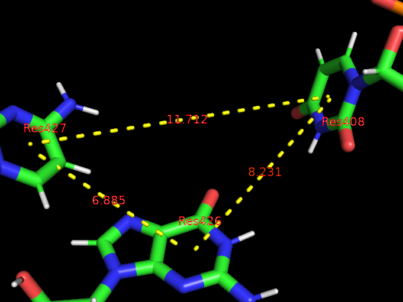
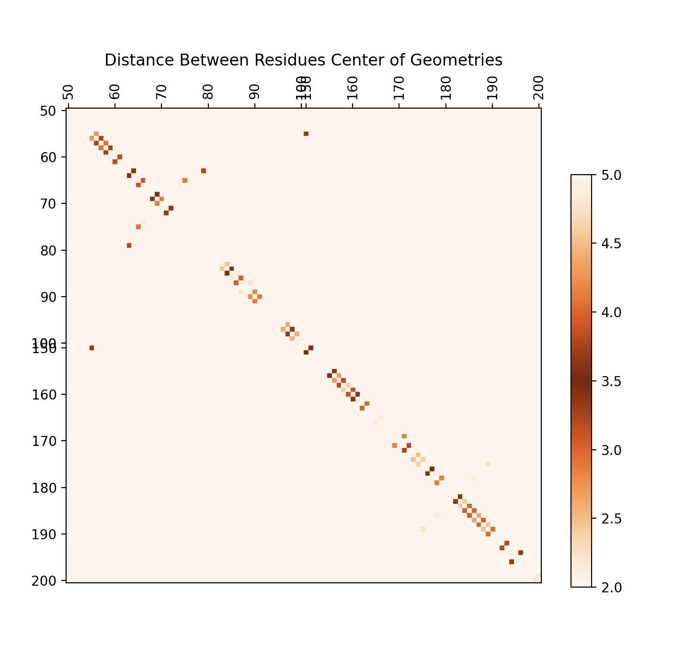

# Testing

## User Interface

Many of the Features are capable of being run directly from the command line, with various flags indicating the specific functions and inputs to run. The basic method to run a command is to run the following command line prompt:

```
python3 stacker.py -s <ROUTINE> [FLAGS]
```

Information on additional flags can be determined by running:

```
python3 stacker.py --help
```

### Filter Trajectory

Users can filter a trajectory file and associated topology with multiple residues and atomnames to a smaller PDB file (combined trajectory and topology)

The command line prompt below takes the trajectory `first10_5JUP_N2_tUAG_aCUA_+1GCU_nowat.mdcrd` and topology `5JUP_N2_tUAG_aCUA_+1GCU_nowat.prmtop` which have around 500 Residues with 20 atoms each and filters to an outputed PDB `command_line_tests/filter/5JUP_N2_tUAG_aCUA_+1GCU_nowat_mdcrd.pdb` with just Residues 426 and 427 and just atoms C2, C4, and C6

```
usage: stacker.py -s filter_traj -trj TRAJECTORY_FILENAME -top TOPOLOGY_FILENAME -o OUTPUT_FILE [-r RESIDUES] [-a ATOM_NAMES]
```

Example:
```
[user]$ python3 stacker.py -s filter_traj -trj first10_5JUP_N2_tUAG_aCUA_+1GCU_nowat.mdcrd -top 5JUP_N2_tUAG_aCUA_+1GCU_nowat.prmtop -o command_line_tests/filter/5JUP_N2_tUAG_aCUA_+1GCU_nowat_mdcrd.pdb -r 426,427 -a C2,C4,C6
```

Looking into this file we see only residues 426/427 (Column 6) and only atoms C2, C4, and C6 (Column 3):

```
$ head command_line_tests/filter/5JUP_N2_tUAG_aCUA_+1GCU_nowat_mdcrd.pdb
MODEL        0
ATOM      1  C6    G A 425      76.043  74.000  47.143  1.00  0.00           C  
ATOM      2  C2    G A 425      76.759  75.533  48.812  1.00  0.00           C  
ATOM      3  C4    G A 425      75.138  74.094  49.385  1.00  0.00           C  
ATOM      4  C6    C A 426      69.477  73.317  48.913  1.00  0.00           C  
ATOM      5  C4    C A 426      69.380  71.739  47.088  1.00  0.00           C  
ATOM      6  C2    C A 426      67.419  72.324  48.189  1.00  0.00           C  
TER       7        C A 426
ENDMDL
MODEL        1
```

### Write Bottaro (PSF) Values to CSV

Users can get the r, rho, and theta values specified in the Bottaro paper (https://doi.org/10.1093/nar/gku972) directly in the command line by specifying a PDB file with only two residues and the atomnames necessary to determine each residue's center of geometry. This data is used to create the Pairwise Stacking Fingerprint (PSF) file. ROUTINE can be {bottaro, pairwise, psf}

```
stacker.py -s psf [-trj TRAJECTORY_FILENAME] [-top TOPOLOGY_FILENAME] [-pdb PDB_INPUT] [-o OUTPUT_FILE] -p PERSPECTIVE_RES -v VIEWED_RES [-pa PERSPECTIVE_ATOMS]
                  [-va VIEWED_ATOMS] [-i INDEX] [-pt PLOT_TYPE] [-po PLOT_OUTFILE] [-fl FRAME_LIST] [-n] [-h]
```

```
[user]$ python3 stacker.py -s bottaro -trj testing/first10_5JUP_N2_tUAG_aCUA_+1GCU_nowat.mdcrd -top testing/5JUP_N2_tUAG_aCUA_+1GCU_nowat.prmtop -pdb testing/5JUP_N2_tUAG_aCUA_+1GCU_nowat_mdcrd.pdb -o command_line_tests/bottaro/tUAG_aCUA_+1GCU_GC_plot.csv -p 426 -v 427 -pa C2,C4,C6 -va C2,C4,C6 
```

This creates the CSV file:
```
[user]$ head command_line_tests/bottaro/tUAG_aCUA_+1GCU_GC_plot.csv
frame,r_dist,rho_dist,theta
0,7.5253415,6.532184,204.02936578860823
1,6.884639,6.051314,199.40646874889745
2,7.301847,6.151191,205.19065334968477
3,6.5815425,5.461494,199.54217751540756
4,7.0760417,5.39195,204.01502054546495
5,7.2589145,6.3483577,201.32674968542617
6,7.4929285,6.414151,205.92967194025135
7,7.1484976,6.035165,202.88441276229827
8,7.344863,5.5412374,217.3004418866312
```

It also outputs a scatterplot.

We can test it again with a 3200-frame trajectory and see that the data for 3200 frames is written to the output:
```
[user]$ python3 stacker.py -s pairwise -pdb testing/5JUP_N2_tUAG_aCUA_+1GCU_nowat_mdcrd_3200frames.pdb -o command_line_tests/bottaro/tUAG_aCUA_+1GCU_GC_plot_3200fr
ames.csv -p 426 -v 427 -pa C2,C4,C6 -va C2,C4,C6 
[user]$ wc -l command_line_tests/bottaro/tUAG_aCUA_+1GCU_GC_plot_3200frames.csv
    3201 command_line_tests/bottaro/tUAG_aCUA_+1GCU_GC_plot_3200frames.csv
```

### Get Residue Distance
Users can determine the distance between two residues given an input frame. Below we get the distance between residues 425 and 426 in frame 2.
```

```

```
[user]$  python3 stacker.py -s res_distance -trj testing/first10_5JUP_N2_tUAG_aCUA_+1GCU_nowat.mdcrd -top testing/5JUP_N2_tUAG_aCUA_+1GCU_nowat.prmtop -f 2 --residue
s 426,427 --atom_names C2,C4,C6

6.8846416
```

We can match our output with the third-party software PyMol, which shows the same distance of 6.885 between Res426 and Res427 (1-indexed in PyMol)


### Create System Stacking Fingerprint (SSF)
We can use the command line to create Distance Matrices like the one seen below where position i,j on the matrix show the distance from residue i to residue j. ROUTINE can be {ssf, system}
```
stacker.py -s ROUTINE -trj TRAJECTORY_FILENAME -top TOPOLOGY_FILENAME [-r RESIDUES] [-i INPUT_FILE] [-f FRAME_NUM | -fl FRAME_LIST] [-o OUTPUT_FILE] [-g N_EVENTS]
                  [-d OUTPUT_FILE] [-B INPUT_FILE] [-l LIMITS] [-y SCALE_STYLE] [-t N_THREADS]
```



The below command line code creates matrices for frames 1-2 and residues 1-10 and writes the plots to the folder `command_line_tests/pairwise/`

```
[user]$ python3 stacker.py -s ssf -trj testing/first10_5JUP_N2_tUAG_aCUA_+1GCU_nowat.mdcrd -top testing/5JUP_N2_tUAG_aCUA_+1GCU_nowat.prmtop -r 90-215 -fl 1-2 
```

## Vector Class
Running the script `vector.py` will run a number of unit tests to confirm the Vector class is working:
```
python3 vector.py
```
Vector addition, coordinate extraction, subtraction, cross product, magnitude, and projection. Additionally it tests for the catching of edge-cases like projecting to the zero-vector

## File Manipulation

Trajectory Files must be combined with a topology file to operate, but PDB files contain trajectory and topology information in one file. The unit tests in `file_manipulation.py` display the feature of converting a trajectory+topology into a PDB file, alongside the ability to filter by residue and atomname.
```
python3 file_manipulation.py
```
The filtered trajectories are printed as a dataframe to show that the filtering worked.

## Residue Movement
Users can run the unit tests in residue_movement to create a CSV file of the r, rho, and theta values specified in the [Bottaro paper](https://doi.org/10.1093/nar/gku972). The unit tests of `residue_movement.py` create these CSV files from inputted PDBs with only two residues. We create these PDBs with the `filter_trj_to_pdb()` function, which shows the operation of proposed Feature 3 as well.
```
python3 residue_movement.py
```

## System Stacking Fingerprint
Users can create matrices where position i,j is the distance from residue i to j in angstroms within a trajectory. These fingerprints are created and visualized by running the `pairwise_distance.py` unit tests. These also use `display_arrays_as_video()` function to display the matrices, which shows Proposed Feature 6

```
python3 pairwise_distance.py
```

## Visualization
Users can display the Stacking Fingerprint and Polar Plots of the Bottaro Values. The Stacking Fingerprits are displayed in the `pairwise_distance.py` unit tests as discussed above. The Polar Plots can be viewed by running the `visualization.py` unit tests.

```
python3 visualization.py
```

This displays three polar plots of the Bottaro values, and also shows the ability to write the outputs to png files. 
